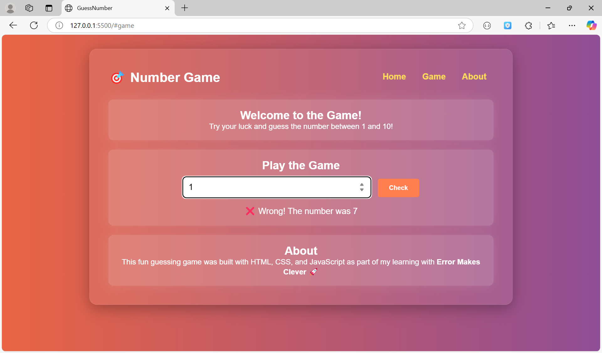

# 🎮 Guess The Number Game

A simple, fun, and responsive **number guessing game** built using **HTML**, **CSS**, and **JavaScript** with cool animations and confetti fireworks 🎆 when you guess the correct number!

---

## 📸 Preview

 

---

## 🔗 Live Demo

🌐 [Click here to play the game](https://ulaganathan0709.github.io/Random_Number_Generator/)

## 🧠 Features

- 🔢 Random number between 1 and 10
- 🎯 Check your guess instantly
- ⌨️ Supports **Enter key** as well as button click
- 📱 Fully **responsive** on all devices
- ✨ **Confetti animation** on correct guess
- 🧊 Modern glass UI with gradient background
- 💻 Built with clean HTML, CSS, and JavaScript

---

## 🚀 How to Run

1. Clone or download this repo
2. Open `index.html` in your browser
3. Type a number between 1 and 10
4. Press **Enter** or click **Check**
5. 🎉 Enjoy the game!

---

## 🔧 Tech Stack

- HTML5
- CSS3 (Glassmorphism + Responsive)
- JavaScript (Vanilla)
- [Canvas Confetti](https://www.npmjs.com/package/canvas-confetti) for firework animation

---

## 🙏 Acknowledgements

- This project was built as part of my learning with **Error Makes Clever**
- Special thanks to [canvas-confetti](https://www.npmjs.com/package/canvas-confetti)

---

## 🧑‍💻 Author

**Ulaganathan A**  
Built with ❤️ by a passionate learner switching from testing to full-stack development.

---

## 📬 Feedback & Contributions

Have suggestions or improvements? Feel free to fork and PR! 😊  
Let's learn and grow together!

---

## 📜 License

This project is open-source and free to use.
